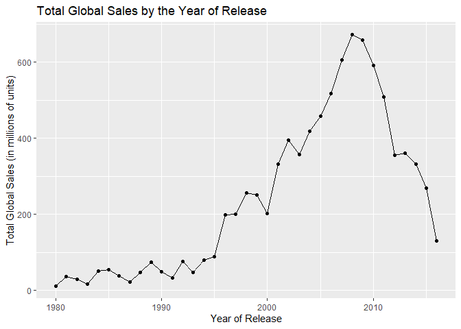

# Analysis of Video Game Sales

### Jacob Bartlett

## Introduction

Video Games are a popular form of entertainment enjoyed by billions of
people worldwide. The games produced range a wide variety of genres and
are available to a variety of ages where there’s a game for anyone to
enjoy. The goal of this analysis is to explore a dataset of video game
sales to better understand the consumer market for video games.

In pursuit of the stated goal, I will explore the following questions:

1.  Which genres tend to sell more units? Which genres are popular in
    different regions of the world?

2.  How is the ESRB rating related to the number of sales? Does the
    rating affect the amount of sales?

3.  How is the critic rating related to the number of sales? How does
    the user rating relate?

4.  How does the amount of global sales change over the years? Is this
    affected by the release of new gaming systems/platforms?

These are the main questions I am looking to answer through the
completion of this project. With the findings I’ll be able to draw
meaningful conclusions on the consumer market of video games throughout
the world.

## Data

### Structure

The link to the data set is
[here](https://www.kaggle.com/datasets/sidtwr/videogames-sales-dataset/data?select=Video_Games_Sales_as_at_22_Dec_2016.csv).
The website contains a csv file of video game sales up until late 2016
with over 16,000 games in the dataset. The number of variables in the
dataset is 16. According to the website, the Metacritic scores come from
a web scrape of their website. Since Metacritic only reviews games on
certain platforms, over half of the games in the dataset are missing
values for the critic and user ratings as well as the developer and ESRB
rating.

### Cleaning

I first read in the main csv file I’ll be utilizing for this analysis.

``` r
library(tidyverse)
game_sales <- read_csv('Video_Game_Sales.csv', show_col_types = FALSE)
```

I then started looking at the different values for `Rating` since some
of the ESRB rating rules have changed over the years.

``` r
game_sales %>% group_by(Rating) %>% tally()
```

    ## # A tibble: 9 × 2
    ##   Rating     n
    ##   <chr>  <int>
    ## 1 AO         1
    ## 2 E       3991
    ## 3 E10+    1420
    ## 4 EC         8
    ## 5 K-A        3
    ## 6 M       1563
    ## 7 RP         3
    ## 8 T       2961
    ## 9 <NA>    6769

There are four values that stand out due to having a low number of
instances in the dataset. These values are AO, EC, K-A, and RP. AO
stands for Adult’s Only and is something that is still currently used by
gaming companies, but it’s very rare for a game to have this rating in
general. RP stands for Rating Pending. EC stands for Early Childhood and
is meant for ages three and up, but this rating is no longer used and is
instead considered E for everyone. K-A stands for Kids to Adults and
this rating was changed in 1998 to E for everyone.

To ensure that the variable Rating is properly analyzed I plan on
removing the rows with a rating of RP since a pending rating won’t
provide any valuable insight to an actual rating. The variable EC and
K-A will also be changed to E ratings since that’s what they would be
considered today.

``` r
game_sales <- game_sales[-c(which(game_sales$Rating == "RP")), ]
game_sales$Rating[game_sales$Rating == "EC"] <- "E"
game_sales$Rating[game_sales$Rating == "K-A"] <- "E"
```

Then I checked the variable types of the dataset to see if any of them
needed to be changed to a more suiting type.

``` r
str(game_sales)
```

    ## tibble [16,716 × 16] (S3: tbl_df/tbl/data.frame)
    ##  $ Name           : chr [1:16716] "Wii Sports" "Super Mario Bros." "Mario Kart Wii" "Wii Sports Resort" ...
    ##  $ Platform       : chr [1:16716] "Wii" "NES" "Wii" "Wii" ...
    ##  $ Year_of_Release: chr [1:16716] "2006" "1985" "2008" "2009" ...
    ##  $ Genre          : chr [1:16716] "Sports" "Platform" "Racing" "Sports" ...
    ##  $ Publisher      : chr [1:16716] "Nintendo" "Nintendo" "Nintendo" "Nintendo" ...
    ##  $ NA_Sales       : num [1:16716] 41.4 29.1 15.7 15.6 11.3 ...
    ##  $ EU_Sales       : num [1:16716] 28.96 3.58 12.76 10.93 8.89 ...
    ##  $ JP_Sales       : num [1:16716] 3.77 6.81 3.79 3.28 10.22 ...
    ##  $ Other_Sales    : num [1:16716] 8.45 0.77 3.29 2.95 1 0.58 2.88 2.84 2.24 0.47 ...
    ##  $ Global_Sales   : num [1:16716] 82.5 40.2 35.5 32.8 31.4 ...
    ##  $ Critic_Score   : num [1:16716] 76 NA 82 80 NA NA 89 58 87 NA ...
    ##  $ Critic_Count   : num [1:16716] 51 NA 73 73 NA NA 65 41 80 NA ...
    ##  $ User_Score     : num [1:16716] 8 NA 8.3 8 NA NA 8.5 6.6 8.4 NA ...
    ##  $ User_Count     : num [1:16716] 322 NA 709 192 NA NA 431 129 594 NA ...
    ##  $ Developer      : chr [1:16716] "Nintendo" NA "Nintendo" "Nintendo" ...
    ##  $ Rating         : chr [1:16716] "E" NA "E" "E" ...

Some of the numerical types could be changed to an integer, but that
doesn’t really effect the data. The only variable whose type needs to be
changed is `Year_of_Release` from a character type to an integer or
numeric type.

``` r
game_sales$Year_of_Release <- as.integer(game_sales$Year_of_Release)
```

Finally, in order to make sure I don’t run into any issues analyzing the
variable `Genre` I checked to see if there were any missing values.

``` r
which(is.na(game_sales$Genre))
```

    ## [1]   660 14246

There are two missing values for the Genre in row 660 and 14,247, and
these same rows are also missing the name of the game. I decided to
remove these since there’s no way to figure out what game the data is
for, and to prevent the missing values from possibly interfering with
the analysis of the variable.

``` r
game_sales <- game_sales[-c(which(is.na(game_sales$Genre))), ]
```

### Variables

- Name: The title of the video game.
- Platform: The gaming platform that the game is on.
- Year_of_Release: The year the video game was released.
- Genre: The main genre of the video game.
- Publisher: The name of the company or corporation that released the
  game.
- NA_Sales: The total number of physical units sold in millions for
  North America.
- EU_Sales: The total number of physical units sold in millions for
  Europe.
- JP_Sales: The total number of physical units sold in millions for
  Japan.
- Other_Sales: The total number of physical units sold in millions for
  the rest of the world.
- Global_Sales: The total number of physical units sold in millions.
- Critic_Score: Aggregate score compiled by Metacritic staff.
- Critic_Count: The number of critics used in coming up with the
  Critic_score.
- User_Score: Score by Metacritic’s subscribers.
- User_Count: Number of users who gave the user_score.
- Developer: Party responsible for creating the game.
- Rating: The ESRB rating.

## Results

#### Which genres tend to sell more units? Which genres are popular in different regions of the world?

``` r
library(patchwork)
p1 <- game_sales %>% group_by(Genre) %>% summarise(total_sales = sum(Global_Sales)) %>% ggplot(aes(x = reorder(Genre, total_sales))) + geom_bar(aes(weight = total_sales)) + coord_flip() + labs(title = "Total Global Sales by Genre", x = "Genre", y = "Total Global Sales (in millions of units)")
p2 <- game_sales %>% group_by(Genre) %>% summarise(Total_NA_Sales = sum(NA_Sales), Total_EU_Sales = sum(EU_Sales), Total_JP_Sales = sum(JP_Sales)) %>% pivot_longer(cols = c(Total_NA_Sales, Total_EU_Sales, Total_JP_Sales), names_to = "Region", values_to = "Sales") %>% ggplot(aes(x = reorder(Genre, Sales), y = Sales)) + geom_bar(stat = "identity") + coord_flip() + facet_grid(. ~ Region) + labs(title = "Total Sales of a Region by Genre", x = "Genre", y = "Total Sales (in millions of units)")
p1 / p2
```

<!-- -->

(Put something here for an analysis)

#### How is the ESRB rating related to the number of sales? Does the rating affect the amount of sales?

``` r
game_sales %>% filter(!is.na(Rating)) %>% group_by(Rating) %>% summarise(total_sales = sum(Global_Sales)) %>% ggplot(aes(x = reorder(Rating, total_sales), y = total_sales)) + geom_bar(stat = "identity") + coord_flip() + labs(titel = "Total Global Sales by ESRB Rating", x = "ESRB Rating", y = "Total Sales (in millions of units)")
```

<!-- -->

(Put an analysis here)

#### How is the critic rating related to the number of sales? How does the user rating relate?

``` r
p3 <- game_sales %>% filter(!is.na(Critic_Score)) %>% ggplot(aes(x = Critic_Score, y = log(Global_Sales))) + geom_point(alpha = 0.5) + geom_smooth(method = "lm", se = FALSE) + labs(title = "Critic Score by Global Sales", x = "Average Critic Score", y = "Log of Global Sales")
p4 <- game_sales %>% filter(!is.na(User_Score)) %>% ggplot(aes(x = User_Score, y = log(Global_Sales))) + geom_point(alpha = 0.5) + geom_smooth(method = "lm", se = FALSE) + labs(title = "User Score by Global Sales", x = "Average User Score", y = "Log of Global Sales")
p3+p4
```

<!-- -->

(Add analysis here)

#### How does the amount of global sales change over the years? Is this affected by the release of new gaming systems/platforms?

``` r
game_sales %>% filter(!is.na(Year_of_Release), Year_of_Release %in% c(1980:2016)) %>% group_by(Year_of_Release) %>% summarise(Total_Global_Sales = sum(Global_Sales)) %>% ggplot(aes(x = Year_of_Release, y = Total_Global_Sales)) + geom_line() + geom_point() + labs(title = "Total Global Sales by the Year of Release", x = "Year of Release", y = "Total Global Sales (in millions of units)")
```

<!-- -->

(Add analysis here)

## Conclusion
